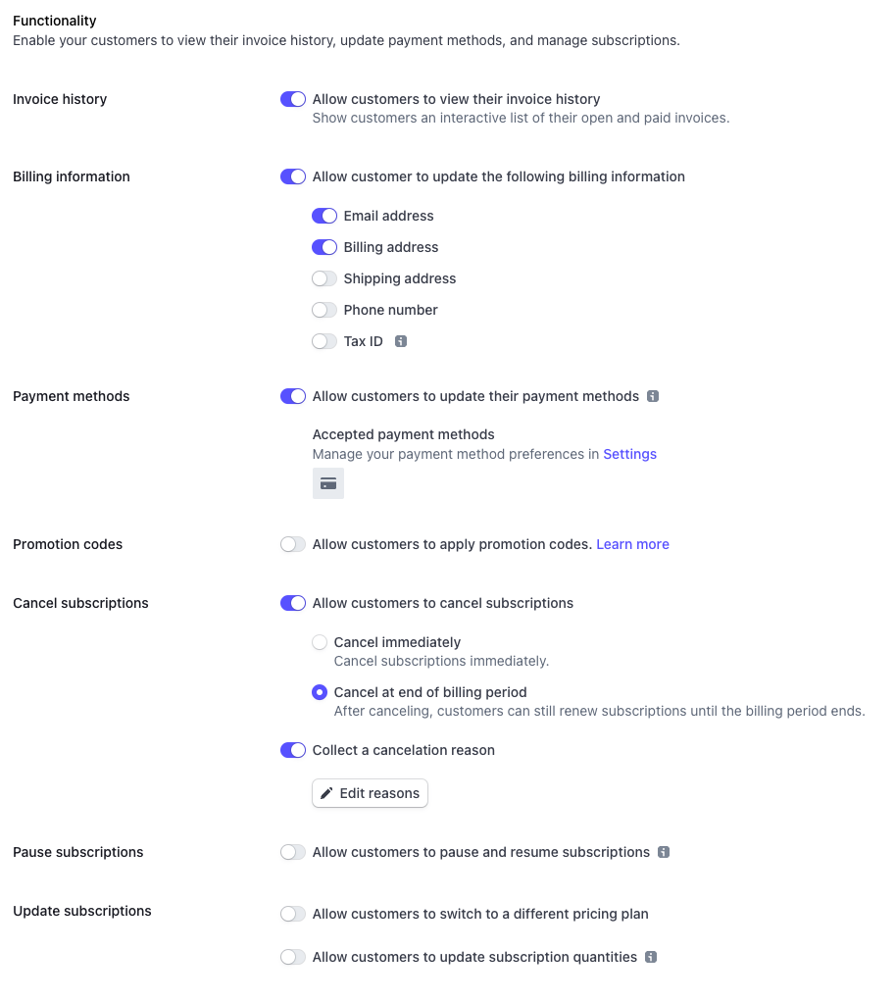
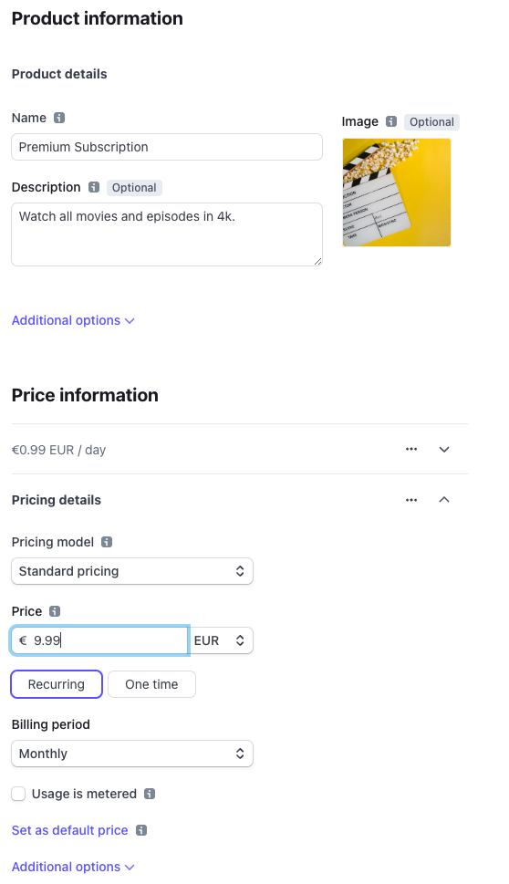
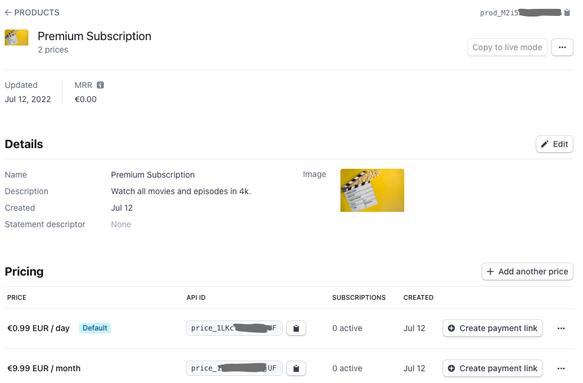

# Mosaic Payment Connector Service Example

## About the Package

This package is part of the Axinom Mosaic development platform. More information
can be found at https://portal.axinom.com/mosaic.

## License

This mono-repo and all packages contained within it are licensed under the MIT
License. Check the LICENSE file for more details.

## Introduction

The Mosaic platform provides monetization capabilities. This includes the option
to create and manage subscription plans, payment plans, and country-specific
prices in the Subscription Monetization Service. The Grants Monetization Service
can be used to specify what a subscription plan includes. And the Mosaic Billing
Service is used to actually purchase subscriptions via payment gateways and
stores subscription details and transaction information.

The Mosaic Monetization solution includes some payment providers out of the box
(e.g. PayPal). And it allows the integration of other payment providers and
gateways via custom-developed payment connectors. This package implements a
custom payment connector via [Stripe](https://stripe.com). It provides a Payment
Connector Service that orchestrates between the Mosaic Billing Service and the
Stripe payment gateway. It allows end users to purchase a subscription via
Stripe and register this subscription and the corresponding payments in the
Mosaic Billing Service.

This repository contains an example of an Axinom Mosaic payment connector that
can be used to integrate additional payment providers with the Axinom Mosaic
Billing service. The example uses Stripe to allow end users to purchase
subscriptions.

The package "frontend-service" is a very basic stub emulating a frontend app end
users would use. In reality, this would be an application where end users can
e.g. watch movies if they have a subscription. The end user will use this
application to subscribe to the service via the Stripe purchase flow through
their website.

The code included in that repository is supposed to be customized by projects.
The Mosaic libraries and services used by that solution will be provided,
updated, and maintained by Axinom.

You can find more details in our online documentation on how to integrate Stripe
under:
[https://portal.axinom.com/mosaic/documentation/media/implement-stripe-as-custom-payment-connector](https://portal.axinom.com/)

## Prerequisites

Before using the customizable solution make sure that you have the following
software installed:

- [node.js](https://nodejs.org/en/) in version 14.\*
- [Yarn](https://classic.yarnpkg.com/en/docs/install) class version

## Prepare and use the payment connector solution

1. Run `yarn` to install all package dependencies for the workspace.
2. Run `yarn apply-templates` to create local copies of all `*.template` files
   in the solution.
3. Follow the steps in the section
   '[Prepare the developer environment](#prepareEnv)' below to set up the
   environment and get all the required configuration values.
4. Set the following parameters in the root `.env` that are specific to your
   development environment:
   - `TENANT_ID`
   - `ENVIRONMENT_ID`
   - `SERVICE_ACCOUNT_CLIENT_ID`
   - `SERVICE_ACCOUNT_CLIENT_SECRET`
5. Add the ID of the created Mosaic application as `APPLICATION_ID` into the
   file `services/frontend-service/service/.env`.
6. Follow the steps in the section
   '[Prepare the subscription settings](#prepareSub)' below to set up Stripe and
   the Mosaic subscription plans.
7. Add the Stripe secret key as `STRIPE_API_SECRET` and the webhook secret as
   `STRIPE_WEBSOCKET_SECRET` into the file
   `services/payment-connector/service/.env`.
8. Run `yarn dev` on the root to start all required scripts. Or run the `dev:ts`
   or `debug` scripts and the `dev:sync-public` and `dev:tunnel` scripts in the
   two services in separate terminals.
9. Run `yarn token` from the frontend application folder:
   `services/frontend-service/service/`
10. Open http://localhost:20000/index.html and paste the token from the above
    step into the JWT field. Follow the directions on the page to purchase a
    subscription.

## Run the solution

Run `yarn dev` to start the frontend application and the payment connector.

## Run tests (optional)

Run `yarn test` to run the unit tests of the solution.

## Prepare the developer environment

Before running the solution you need to create a Mosaic development environment.
In order to do this, go over to https://admin.service.eu.axinom.com and log in
using the tenant id, username, and password provided to you by Axinom.

After successful login, select the "Environments" tile and click the '+'-icon to
create a new environment.

Provide a user name and select the "Development" template.

The template will automatically create a management user on environment
creation. You can adjust the email and password for that user in the text boxes
below the template selection. By default, it will match the email address of
your Environment Administration user.

The 'Management System Subdomain' is the subdomain under which the management
system will be publicly available. For development, the management system will
primarily be used from 'localhost', so this value is not too important for now
and is also possible to be changed later still.

After hitting 'Proceed', the environment will be created and the 'Environment
Connection' screen will show up. Download the Environment Settings file.

All the services are now enabled. From the optional services the "User Service"
and the "Billing & Monetization Services" are required.

Go to "Service Accounts" and create a new service account "stripe-connect".
Download the settings file and keep the `TENANT_ID`, `ENVIRONMENT_ID`,
`CLIENT_ID`, and `CLIENT_SECRET` settings for later.

Go to "Permissions" and make sure at least the following 2 permissions are
assigned:

- `BILLING SERVICE (Managed by Axinom) > Subscriptions: Edit`.
- `BILLING SERVICE (Managed by Axinom) > Settings: View`.

Optional: Purchasing subscriptions via Stripe requires the JWT from an end user.
To make this process easier you can run the `token` script from the file
`services/frontend-service/service/package.json` to generate a testing end user
JWT. To be able for the script to create test tokens the service account
requires the permission
`IDENTITY SERVICE (Managed by Axinom) > DEV Access Tokens: Generate with Permissions`.

Now follow the guide
[Configure a Managed IDP Connection (External)](<https://portal.axinom.com/mosaic/documentation/media/configure-a-managed-idp-connection-(external)>)
from the Axinom Portal. After following this guide you have a way to log in end
users via a 3rd party identity provider like Google. And you created an
application that can use the configured identity provider to log into this
application.

Finally, go to Billing & Monetization Services configuration for your
environment and enter the following values:

- Success Redirect URL: http://localhost:20000/success.html
- Cancel Redirect URL: http://localhost:20000/cancelled.html

## Prepare the subscription settings

### Stripe

First, we need to create a Stripe account. Open
https://dashboard.stripe.com/register in your browser and sign up for an
account. Once you have verified the email address you can for now skip the setup
of active payments in Stripe.

In the top right click on the gears icon to go to the settings. From there open
"Account details" and provide a name like "Mosaic Stripe Demo". Go back to the
settings overview page and open "Customer portal".

You can adjust the branding and business information to your needs. For the
functionality section, you can enable the following settings. Some settings are
not supported on the Mosaic Billing Service side. Please do not enable them in
Stripe.

- Invoice history: allow customers to view their invoice history can be enabled
- Billing information: Email and Billing address can be checked. The others are
  not supported from the Mosaic side.
- Payment methods: allow customers to update their payment methods can be
  enabled
- Promotion codes: not supported
- Cancel subscriptions: you can enable any of the options
- Pause subscriptions: not supported
- Update subscriptions: not supported

For this example we use:

Once you configured the billing portal click Save.

From the Stripe Dashboard open `Products` from the main navigation. In there
click on "Add product". Create a new product with a price:

- Name: Premium Subscription
- Description: Watch all movies and episodes in 4k.
- Image: (optional) e.g. https://unsplash.com/photos/q8P8YoR6erg

Create the first price:

- Pricing model: Standard pricing
- Price 0.99 EUR
- Select: Recurring
- Billing period: Daily
- This is the default price (keep this selected)

Create the second price:

- Pricing model: Standard pricing
- Price 9.99 EUR
- Select: Recurring
- Billing period: Monthly
- Don't make this the default price

The page should now look similar to this:

Save the product now.

Stripe created now a unique identifier for the Product (prod_M2i5...), for the
daily recurring price (price_1L...KRr), and for the monthly recurring price
(price_1L...MgX):

Go to the section `Developers > API keys`. Get the "Secret key" (for testing it
starts with `sk_test_`).

On the left side navigate to "Webhooks" and select "Test in a local
environment". Follow those steps to download the Stripe CLI and log into stripe
via the CLI. For Windows-based systems, you might need to add the path to the
`.exe` file to the Windows PATH variable. Note down the webhook secret that you
find in the code example to the right (starting with `whsec_*`).

### Configure the Stripe custom payment connector

Navigate to the Mosaic Environment Administration Portal and open your
environment. Go to `Service Configuration > Payment Providers` and click on
"new". Select type "Custom Payment Provider". For the Key use `STRIPE` and
`Stripe` as the title.

### Prepare Mosaic subscription plans

Open your Mosaic Management System and navigate to `Monetization > Claim Sets`.
Create a new Claim set and give it the title "Premium" and the unique key
"PREMIUM". Select the desired claims. Then publish the claim set.

Navigate now to `Monetization > Subscription Plans`. Create a new subscription
plan with the title "Premium Subscription". You can optionally add a description
and select a cover image for the subscription plan.

In the "Payment Providers & Settings" section add "Stripe" as the payment
provider. Put the Stripe product ID (`prod_*`) into the "External Id" field.

Navigate to "Payment Plans" and click on the '+'-icon. Set the title as "Daily"
and proceed.

In the "Recurrence Period" add "1" into the text box and from the dropdown box
select "day(s)". In the section "Payment Providers & Settings" select "Stripe"
as the payment provider. Pick the Stripe price ID from the daily price
(`price_*`) and set it as "External Id". Go to "Price per Country", select a
specific country or the "XX - Unknown Country", add "0.99" as the price and
"EUR" as the currency - click on the "+"-icon.

Go back to the payment plans explorer station and click on new. Add a second
payment plan with the title "Monthly". For the recurrence period enter "1" and
"month(s)". Add "Stripe" as the payment provider. Pick the monthly price ID from
Stripe (`price_*`) and set it as the External ID on the payment plan. Go to the
"Price per Country" station and enter the 9.99 EUR similar to the daily one.

Go now back to the subscription plan detail station and from there go to "Manage
Claim Sets" and select the "Premium" claim set.

Go back again to the subscription plan detail station and click on "Publishing".
Make sure no errors are shown and click on "Publish" and confirm.

## License

This repository and all packages contained within it are licensed under the MIT
License. Check the LICENSE files for more details.
